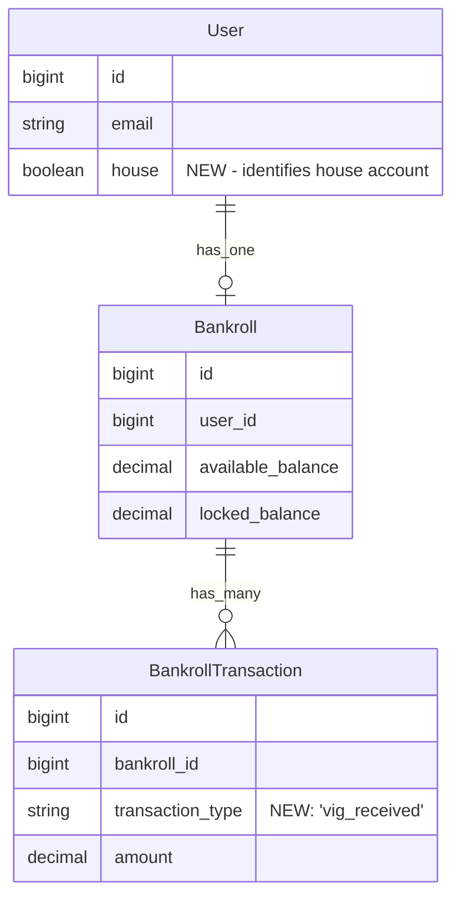

# feat: House Vigorish Account with Navbar Display

**Version**: 1.0
**Date**: December 14, 2025
**Status**: Planning

---

## Overview

Add a "House" vigorish account to track and publicly display how much money the house collects from betting operations. The FAQ (lines 150-179) states:

> "We track the house vig publicly so you can see exactly how much of the betting pool goes to 'the house' over time."

This feature creates a special house user with a bankroll that accumulates vigorish (vig) from lost bets, displays the balance prominently in the navbar, and provides a dashboard showing the house's transaction history.

## Problem Statement / Motivation

Currently, the FAQ promises public vigorish tracking, but this functionality doesn't exist. Users cannot see:
- How much total vig the house has collected
- The transaction history of vig accumulation
- The educational value of understanding how the house edge works over time

This feature fulfills the FAQ's promise and provides transparency into the sportsbook's mechanics.

## Proposed Solution

### High-Level Approach

1. **Create a special "House" user** with a singleton pattern (one house user per app)
2. **Start the house with $5,000** (same as regular users for consistency)
3. **Transfer vig to house when bets are lost** (the bet amount minus what would be a fair payout)
4. **Display house balance in navbar** for all visitors (authenticated or not)
5. **Provide clickable link to house dashboard** showing transaction history

### Key Design Decisions

| Decision | Choice | Rationale |
|----------|--------|-----------|
| House account type | Special User with `house: true` flag | Reuses existing User/Bankroll/Transaction infrastructure |
| Starting balance | $5,000 | Consistent with regular users, FAQ mentions this amount |
| Vig calculation | Implicit in odds (difference between fair odds and actual odds) | Standard sportsbook model - no explicit vig calculation needed |
| Navbar display | Always visible (logged in or not) | Educational transparency for all visitors |
| Dashboard access | Public (anyone can view) | Matches FAQ's "track publicly" promise |

---

## Technical Approach

### Architecture



### Implementation Phases

#### Phase 1: House User and Database Changes

**Tasks:**
1. Add `house` boolean column to users table (default: false)
2. Add `vig_received` transaction type to BankrollTransaction
3. Create `User.house` class method (singleton finder/creator)
4. Seed the house user with $5,000 starting balance

**Files:**
- `db/migrate/TIMESTAMP_add_house_to_users.rb`
- `app/models/user.rb`
- `app/models/bankroll_transaction.rb`
- `db/seeds.rb`

**Success Criteria:**
- `User.house` returns the house user (creates if needed)
- House user has bankroll with $5,000 initial balance
- No duplicate house users can be created

#### Phase 2: Navbar Display

**Tasks:**
1. Add house balance display to navbar (before user balance)
2. Make it clickable, linking to house dashboard route
3. Style consistently with existing navbar elements
4. Display for all visitors (not just authenticated users)

**Files:**
- `app/views/layouts/application.html.erb`
- `app/helpers/application_helper.rb`

**Success Criteria:**
- House balance visible in navbar on all pages
- Displays formatted currency (e.g., "$5,000.00")
- Clicking navigates to house dashboard
- Styled with house-specific color (suggested: gold/yellow for "house money")

#### Phase 3: House Dashboard

**Tasks:**
1. Create `HouseController` with `show` action
2. Add route `GET /house` for house dashboard
3. Create dashboard view reusing bankroll show pattern
4. Display house stats and recent transactions

**Files:**
- `app/controllers/house_controller.rb`
- `app/views/house/show.html.erb`
- `config/routes.rb`

**Success Criteria:**
- `/house` route displays house dashboard
- Shows total balance, available/locked breakdown
- Shows recent transactions with vig_received entries
- Public access (no authentication required)

#### Phase 4: Vig Transfer on Bet Settlement

**Tasks:**
1. Modify `SettleBetsJob` to transfer vig when bets are lost
2. Calculate vig amount (bet amount for lost bets)
3. Create `vig_received` transaction on house bankroll
4. Add `Bankroll#receive_vig` method

**Files:**
- `app/jobs/settle_bets_job.rb`
- `app/models/bankroll.rb`
- `app/models/bet.rb`

**Success Criteria:**
- When bet is lost, vig transfers to house
- House bankroll transaction created with reference to bet
- House balance increases by bet amount
- Existing bet settlement logic unchanged

---

## Acceptance Criteria

### Functional Requirements

- [ ] House user exists with `house: true` flag
- [ ] House starts with $5,000 balance
- [ ] Only one house user can exist (singleton)
- [ ] Navbar displays house balance for all visitors
- [ ] House balance is clickable and navigates to `/house`
- [ ] House dashboard shows balance and transaction history
- [ ] Lost bets transfer vig to house account
- [ ] `vig_received` transactions appear in house history

### Non-Functional Requirements

- [ ] Navbar loads quickly (house balance cached if needed)
- [ ] House dashboard accessible without authentication
- [ ] Mobile-responsive house balance display

### Quality Gates

- [ ] Unit tests for User.house singleton
- [ ] Unit tests for Bankroll#receive_vig
- [ ] Integration test for bet settlement with vig transfer
- [ ] System test for house dashboard access

---

## User Flows

### Flow 1: Visitor Views House Balance

```
1. Visitor loads any page
2. Navbar displays "House: $X,XXX.XX" (or similar label)
3. Visitor clicks house balance
4. Browser navigates to /house
5. House dashboard displays:
   - Total balance (prominently)
   - Available/locked breakdown
   - Recent vig_received transactions
```

### Flow 2: Bet Settlement Transfers Vig

```
1. Game completes with final score
2. SettleBetsJob runs
3. For each pending bet on the game:
   a. Determine result (won/lost/push)
   b. If LOST:
      - User's locked balance reduced by bet amount
      - House receives vig_received transaction for bet amount
      - House available_balance increases
   c. If WON:
      - User receives payout (no vig to house)
   d. If PUSH:
      - User's stake returned (no vig to house)
4. House balance in navbar reflects new total
```

### Flow 3: First-Time Setup (Seeds)

```
1. Developer runs `bin/rails db:seed`
2. Seed creates or finds house user
3. If new: creates bankroll with $5,000
4. House user ready for vig accumulation
```

---

## Edge Cases

| Scenario | Expected Behavior |
|----------|-------------------|
| No house user exists yet | `User.house` creates one with $5,000 bankroll |
| House user deleted accidentally | `User.house` recreates on next access |
| Multiple concurrent vig transfers | Use database transactions for integrity |
| House balance negative | Should never happen (only receives vig, never loses) |
| Very large house balance | Display formatted (e.g., "$1,234,567.89") |

---

## Code Examples

### User Model (Singleton Pattern)

```ruby
# app/models/user.rb
class User < ApplicationRecord
  # ... existing code ...

  # Singleton pattern for house user
  def self.house
    find_or_create_by!(house: true) do |user|
      user.email = "house@hideaway.local"
      user.password = SecureRandom.hex(32)
      user.name = "The House"
    end
  end

  # Prevent multiple house users
  validates :house, uniqueness: true, if: :house?

  private

  def create_default_bankroll
    return if house? && bankroll.present? # Don't recreate house bankroll
    create_bankroll!(
      currency: "USD",
      available_balance: Bankroll::INITIAL_BALANCE
    )
  end
end
```

### Bankroll Vig Receiver

```ruby
# app/models/bankroll.rb
class Bankroll < ApplicationRecord
  # ... existing code ...

  # Receive vigorish from lost bet
  def receive_vig(amount, bet_id, **options)
    return error_result("Vig amount must be positive") unless amount > 0

    balance_before = available_balance
    self.available_balance += amount

    transaction = bankroll_transactions.create!(
      transaction_type: "vig_received",
      amount: amount,
      balance_before: balance_before,
      balance_after: available_balance,
      reference_id: bet_id.to_s,
      description: "Vig from lost bet ##{bet_id}",
      metadata: options[:metadata] || {}
    )

    save!

    success_result(
      transaction: transaction,
      available_balance: available_balance,
      message: "Received #{amount} #{currency} in vig"
    )
  rescue StandardError => e
    error_result("Failed to receive vig: #{e.message}")
  end
end
```

### BankrollTransaction Update

```ruby
# app/models/bankroll_transaction.rb
class BankrollTransaction < ApplicationRecord
  TRANSACTION_TYPES = %w[
    deposit
    withdrawal
    bet_placed
    bet_won
    bet_lost
    bet_canceled
    bet_push
    vig_received  # NEW
  ].freeze

  # ... rest unchanged ...
end
```

### Migration

```ruby
# db/migrate/TIMESTAMP_add_house_to_users.rb
class AddHouseToUsers < ActiveRecord::Migration[8.1]
  def change
    add_column :users, :house, :boolean, default: false, null: false
    add_index :users, :house, unique: true, where: "house = true"
  end
end
```

### Navbar Update

```erb
<!-- app/views/layouts/application.html.erb -->
<!-- Add before user balance display -->

<!-- House Balance (always visible) -->
<%= link_to house_path, class: "text-yellow-500 text-base font-bold hover:text-yellow-400 transition-colors duration-200 flex items-center gap-1" do %>
  <span class="text-xs">HOUSE</span>
  <%= number_to_currency(User.house.bankroll&.total_balance || 0, precision: 2) %>
<% end %>
```

### House Controller

```ruby
# app/controllers/house_controller.rb
class HouseController < ApplicationController
  # No authentication required - public access
  skip_before_action :authenticate_user!, raise: false

  def show
    @house_user = User.house
    @bankroll = @house_user.bankroll
    @recent_transactions = @bankroll.transaction_history(limit: 20)
    @stats = @bankroll.stats
  end
end
```

### Routes

```ruby
# config/routes.rb
Rails.application.routes.draw do
  # ... existing routes ...

  # House dashboard (public)
  resource :house, only: [:show], controller: 'house'
end
```

### SettleBetsJob Update

```ruby
# app/jobs/settle_bets_job.rb
class SettleBetsJob < ApplicationJob
  # ... existing code ...

  private

  def settle_game_bets(game)
    game.bets.pending.find_each do |bet|
      result = bet.determine_result
      next unless result

      ActiveRecord::Base.transaction do
        case result
        when 'lost'
          bet.settle!
          # Transfer vig to house
          User.house.bankroll.receive_vig(
            bet.amount,
            bet.id,
            metadata: { game_id: game.id, user_id: bet.user_id }
          )
        else
          bet.settle!
        end
      end
    rescue => e
      Rails.logger.error("Failed to settle bet #{bet.id}: #{e.message}")
    end
  end
end
```

---

## Dependencies & Prerequisites

- Existing User/Bankroll/BankrollTransaction models
- SettleBetsJob for bet settlement
- Devise authentication (for skipping auth on house routes)

---

## Risk Analysis & Mitigation

| Risk | Impact | Mitigation |
|------|--------|------------|
| Duplicate house users | Data integrity | Unique constraint on `house` column |
| Slow navbar load | UX degradation | Cache house balance with Russian Doll caching |
| Missing vig on settlement | Incorrect house balance | Database transaction wrapping settlement + vig |
| House balance display on mobile | Layout issues | Test responsive design thoroughly |

---

## Future Considerations

- **House Statistics Dashboard**: Show win rate, total bets processed, busiest times
- **Time-based Charts**: Graph vig accumulation over time
- **Comparison Feature**: Show user's P&L vs house P&L
- **House Balance Milestones**: Celebrate when house reaches certain thresholds

---

## References & Research

### Internal References

- FAQ vigorish section: `app/views/pages/faq.html.erb:150-179`
- User model: `app/models/user.rb`
- Bankroll model: `app/models/bankroll.rb:1-364`
- BankrollTransaction: `app/models/bankroll_transaction.rb:1-36`
- Navbar layout: `app/views/layouts/application.html.erb:28-66`
- Bankroll dashboard pattern: `app/views/bankrolls/show.html.erb:1-95`
- Bet settlement: `app/jobs/settle_bets_job.rb`
- Database schema: `db/schema.rb:270-286` (users table)

### External References

- Rails 8 Guides: [Active Record Migrations](https://guides.rubyonrails.org/active_record_migrations.html)
- Rails Partial Index: [Unique constraint with condition](https://www.postgresql.org/docs/current/indexes-partial.html)

### Related Work

- Bankroll system design: `docs/BETTING_SYSTEM_DESIGN.md`
- Recent feature: Automatic $5,000 bankroll (PR #20)

---

## Glossary

| Term | Definition |
|------|------------|
| **Vigorish (Vig)** | Commission the house takes on bets; built into the odds |
| **House** | The sportsbook operator that accepts bets |
| **Singleton** | Design pattern ensuring only one instance exists |
| **Juice** | Another term for vigorish |

---

## Open Questions

1. **Should house balance show in footer too?** Or just navbar?
2. **Should there be a "House Rules" or "How Vig Works" explanation on the house dashboard?**
3. **Should the house dashboard show which bets contributed to vig?** (Linked bet IDs)

---

**Document Version History:**
- v1.0 (2025-12-14): Initial plan created
